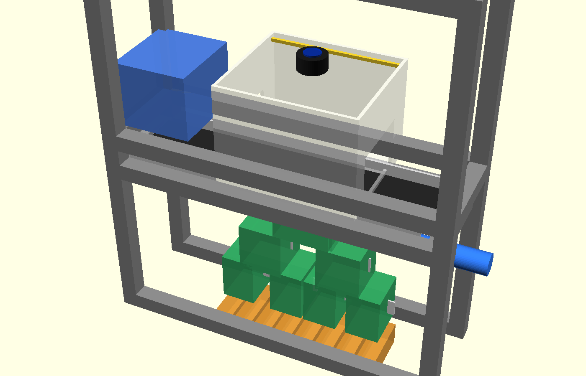
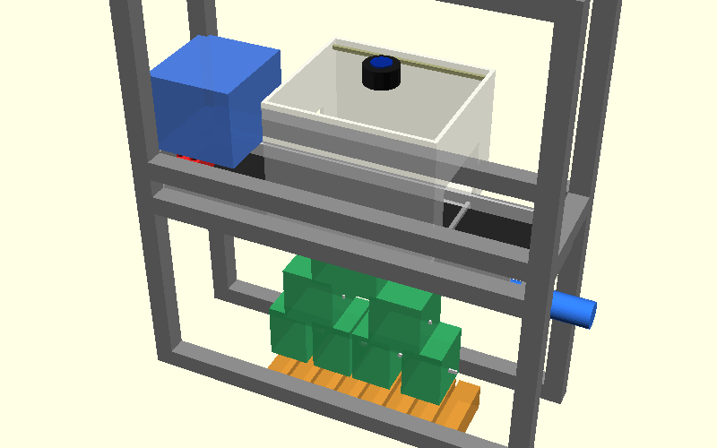
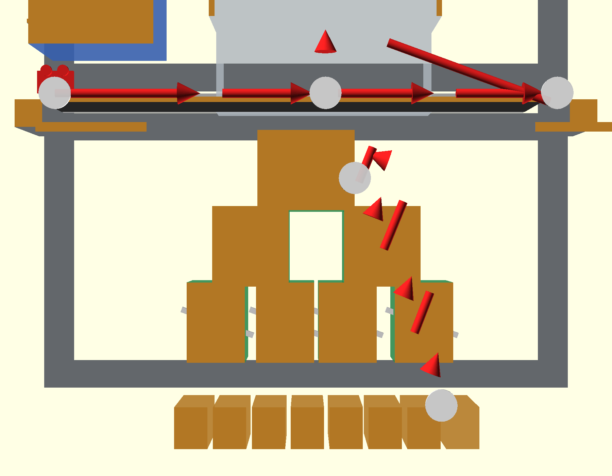

# LEGO AI Sorting Machine v3







An AI-powered LEGO brick sorting machine built on a Raspberry Pi 5. Combines computer vision, a Brickognize REST API, a local learning cache, and a 31-servo binary gate tree to automatically classify and route bricks into 32 output bins in real time.

---

## Table of Contents

- [Quick Start](#quick-start)
- [Architecture Overview](#architecture-overview)
- [Project Structure](#project-structure)
- [Modules & Features](#modules--features)
  - [main.py — Orchestrator](#mainpy--orchestrator)
  - [conveyor.py — Belt Motor Control](#conveyorpy--belt-motor-control)
  - [scanner.py — Camera & Motion Detection](#scannerpy--camera--motion-detection)
  - [classifier.py — AI Classification](#classifierpy--ai-classification)
  - [sorter.py — Binary Gate Tree](#sorterpy--binary-gate-tree)
  - [inventory.py — SQLite Database](#inventorypy--sqlite-database)
  - [web_ui.py — Flask Dashboard](#web_uipy--flask-dashboard)
  - [logger.py — Structured Logging](#loggerpy--structured-logging)
- [Sort Modes](#sort-modes)
- [Confidence Routing](#confidence-routing)
- [Web Dashboard](#web-dashboard)
- [API Reference](#api-reference)
- [Configuration](#configuration)
- [Error Recovery](#error-recovery)
- [Testing](#testing)
- [Hardware Requirements](#hardware-requirements)
- [Auto-Start on Boot](#auto-start-on-boot)

---

## Quick Start

### 1. Install dependencies
```bash
pip install -r requirements.txt --break-system-packages
```

On Raspberry Pi, also install hardware libraries:
```bash
pip install RPi.GPIO adafruit-circuitpython-pca9685 adafruit-circuitpython-motor --break-system-packages
```

### 2. Configure
Edit `config.yaml` to match your hardware:
- GPIO pin numbers for stepper motor and LEDs
- PCA9685 I2C addresses
- Belt speed and encoder settings
- Confidence thresholds
- Bin assignments for part categories
- Sort mode (`part`, `color`, `category`, `set`)

### 3. Test components individually
```bash
# Test camera capture
python main.py --test-camera

# Test classification on a photo
python main.py --test-classify photo_of_brick.jpg

# Test all servo gates
python main.py --test-gates

# Start web dashboard without hardware (simulation mode)
python main.py --web-only

# Start with color sorting mode
python main.py --sort-mode color
```

### 4. Run the full system
```bash
python main.py
```

Web dashboard available at `http://<pi-ip>:5000`

### 5. Run tests
```bash
python -m pytest tests/ -v
```

---

## Architecture Overview

```
Motion Detected
    ↓
[Scanner] Pause Belt → Capture Frames → Select Sharpest → Crop Brick
    ↓
[Classifier] Check Local Cache ──► Cache Hit → Return Cached Result
    ↓ Cache Miss
[Brickognize API] POST JPEG → Parse Response (part_id, color, confidence)
    ↓ Low Confidence (optional rescan)
[Main] Advance Belt → Capture 2nd Angle → Reclassify
    ↓
[Confidence Routing]
  ├─ High (≥0.65) → [Sorter] Binary Gate Tree → Correct Bin
  ├─ Mid  (0.45–0.65) → Review Bin (30)
  └─ Low  (<0.45)     → Unknown Bin (31)
    ↓
[Inventory] Log Part → Update Set Tracking → Hourly Stats
    ↓
[Web Dashboard] Real-time Display & Controls
```

Three threads run concurrently:
- **Main thread**: Flask web server
- **Sorting loop**: Motion → Classify → Sort pipeline
- **Retry loop**: API recovery — reclassifies queued items every 30 seconds

---

## Project Structure
```
lego-sorter/
├── main.py              # Entry point and orchestrator
├── config.yaml          # All configuration and bin assignments
├── conveyor.py          # Stepper motor belt control (with encoder feedback)
├── scanner.py           # Camera capture + motion detection (multi-angle)
├── classifier.py        # Brickognize API + local learning cache
├── sorter.py            # Binary gate tree + multi-sort-mode routing
├── inventory.py         # SQLite database + Rebrickable + analytics + export
├── web_ui.py            # Flask web dashboard + OTA config + REST API
├── logger.py            # Structured JSON logging with file rotation
├── lego-sorter.service  # systemd unit file for auto-start
├── templates/
│   └── dashboard.html   # Responsive single-page dashboard (Bootstrap)
├── tests/
│   ├── test_sorter.py      # Gate tree routing and sort mode tests
│   ├── test_classifier.py  # Cache, confidence, and category tests
│   └── test_inventory.py   # Database, stats, and export tests
├── logs/
│   └── sorter.log       # Rotating JSON log files (auto-created)
├── requirements.txt
└── README.md
```

---

## Modules & Features

### main.py — Orchestrator

The central controller (`SortingMachine` class) that wires all subsystems together.

**Features:**
- Starts and coordinates all subsystems (conveyor, scanner, classifier, sorter, inventory, web UI)
- Manages graceful shutdown on SIGINT/SIGTERM
- **Auto-rescan**: If classification confidence is low, the belt advances slightly and a second image is captured automatically; tracks rescan success rate
- **API Retry Queue**: Holds up to 20 failed classifications in memory; a background thread retries every 30 seconds when the API recovers
- **OTA Configuration**: Applies runtime config changes (belt speed, thresholds, LED brightness) from the web dashboard without restarting
- **Power Sequencing**: Controls servo power relay via GPIO 22 (enabled on init, disabled on shutdown to prevent brown-out)
- Simulation mode: All hardware interfaces fall back to no-ops when RPi libraries are unavailable

---

### conveyor.py — Belt Motor Control

Controls the conveyor belt stepper motor with optional closed-loop feedback.

**Features:**
- Drives a **NEMA 17 stepper motor** via a **TMC2209** driver (step/dir/enable GPIO pins)
- Configurable belt speed (5–100 mm/s), dynamically adjustable at runtime
- **Closed-loop encoder feedback** (optional):
  - Reads a rotary encoder (channels A/B) via GPIO interrupts
  - Measures actual belt speed from pulses-per-revolution and roller circumference
  - Proportional speed correction (Kp = 0.3) adjusts step delays every 250 ms
- **Pause/Resume**: Stops belt during scanning, resumes after classification (configurable pause delay, default 300 ms)
- Thread-safe pause/resume lock for coordination with sorting loop

---

### scanner.py — Camera & Motion Detection

Handles image capture, motion detection, and brick isolation.

**Features:**
- Supports **Pi Camera Module 3** (primary, up to 1920×1080) and an optional secondary USB camera for multi-angle classification
- **Motion detection**: Frame differencing with Gaussian blur and pixel threshold — triggers belt pause and capture when a brick enters the scanning chamber
- **Background reference frame**: Captured at startup and refreshable via the dashboard API (`/api/control/update_background`)
- **Best-frame selection**: Captures a configurable number of frames and selects the sharpest using Laplacian variance
- **Auto-exposure warmup**: Discards first 30 frames at startup to stabilize camera exposure
- **Brick cropping**: Contour detection with configurable padding to isolate the brick in the frame
- **LED control**: PWM-controlled LED strip (GPIO 12, 1000 Hz) with configurable brightness (0–100%)
- **MJPEG streaming**: Provides live video feed endpoints for the web dashboard

---

### classifier.py — AI Classification

Identifies bricks using the Brickognize REST API and a local learning cache.

**Brickognize API:**
- POSTs JPEG images to `https://api.brickognize.com/predict/`
- Returns: `part_id`, `part_name`, `color`, `confidence` (0–1), and up to 3 alternative matches
- Timeout: 10 seconds; 2 automatic retries on failure with 1-second delays
- Supports multi-angle classification (secondary image improves confidence)

**Local Learning Cache:**
- Avoids API calls for previously seen bricks
- Signature: **HSV color histogram** (8×8×4 bins, 256 buckets) + **aspect ratio**
- Similarity: Bhattacharyya coefficient (70% histogram + 30% aspect ratio)
- **Auto-learns** API results with confidence ≥ 0.85
- **Manual corrections** from the Review tab stored with confidence = 1.0
- Persistence: JSON file on disk; FIFO eviction when cache exceeds 200 entries
- Match threshold: 0.90 similarity required to use a cached result

**Confidence Routing:**
- High (≥ 0.65): Auto-sort to correct bin
- Mid (0.45–0.65): Route to review bin (30) for human verification
- Low (< 0.45): Route to unknown bin (31)

**Category Extraction:**
- 65 keyword patterns covering detailed LEGO taxonomy (bricks, plates, tiles, technic, slopes, arches, etc.)
- Specificity-ordered matching (e.g., "Brick 2x4" matched before generic "Brick")
- Fallback: "Other" category for unrecognized parts

**Statistics tracked:** total classifications, successes, failures, review count, accuracy rate, cache hits/misses

---

### sorter.py — Binary Gate Tree

Routes bricks through a physical binary gate tree into one of 32 bins.

**Hardware:**
- **31 servo gates** across **2× PCA9685** 16-channel PWM boards (I2C: 0x40, 0x41)
- Top 3 levels (7 gates): **MG90S** metal-gear servos (higher torque, durable)
- Bottom 2 levels (24 gates): **SG90** micro servos (cost-effective)
- Configurable pulse widths per servo type and settle time (default 120 ms)

**Gate Tree:**
- 5-level binary tree: Level 0 (root, 1 gate) → Level 4 (16 gates) = 31 total gates, 32 leaf bins
- Routing: Binary decomposition of the bin number determines left/right path at each level
- Gates 0–15 on board 1, gates 16–30 on board 2

**Sort Modes:**
| Mode | Routing Logic |
|------|---------------|
| **Part** (default) | Keyword-matched part type → `bin_assignments` in config |
| **Color** | `COLOR_BIN_MAP` — 32 named colors mapped to specific bins |
| **Category** | Broad groups: bricks→0, plates→1, tiles→2, technic→4, slopes→5, etc. |
| **Set** | Parts needed for a target LEGO set get priority bins; others go to overflow |

**Bin Management:**
- Per-bin part count tracking; warns at 50+ items per bin
- Gate actuation counter per gate; logs maintenance warning at 10,000 actuations
- Individual or full bin reset via dashboard API

---

### inventory.py — SQLite Database

Persistent storage for all sort history, analytics, and set tracking.

**Database Tables:**
| Table | Purpose |
|-------|---------|
| `sorted_parts` | Full history: part_id, name, color, bin, confidence, timestamp |
| `set_inventories` | Rebrickable set part lists (part_id, color, quantity needed/found) |
| `sets` | Set metadata: name, year, total part count |
| `sort_history` | Hourly aggregated counts for analytics charts |
| `corrections` | Reclassification feedback log (old bin → new bin) |

**Statistics:**
- Total sorted, identified, unique parts, average confidence
- Throughput: parts/minute (last 10 min), parts/hour, parts/day, peak hour, session duration
- Confidence distribution histogram (10 buckets, 0–100%)
- Top 10 categories and top 10 colors (last 10 entries)
- Review parts list (needs_review flag)

**Rebrickable Integration:**
- Fetches set part lists via paginated Rebrickable API (100 parts/page)
- Tracks parts found vs. quantity needed per set
- Reports completion percentage per target set

**Export Formats:**
- **BrickLink CSV**: Part ID, Color, Quantity
- **Rebrickable CSV**: Part, Color, Quantity
- **Missing Parts CSV**: Parts still needed to complete a specific set

---

### web_ui.py — Flask Dashboard

Single-page web application for monitoring and controlling the machine.

**Dashboard Tab:**
- Live MJPEG camera feed (primary + optional secondary)
- Current machine state: running / idle / classifying / scanning / sorting
- Recent 30 sorted parts with part name, color, bin, and timestamp
- Real-time stats: total sorted, identified, unique parts, accuracy
- Bin status panel: highlights bins at or above capacity (≥50 items)
- Set tracking: shows completion progress for target LEGO sets
- Controls: Start / Stop / Pause / Resume
- Belt speed slider (5–100 mm/s)
- Sort mode selector (Part / Color / Category / Set)
- Inventory CSV export button

**Analytics Tab:**
- Throughput metrics: last-hour count, 24-hour count, peak hour, avg/hour, session duration
- Sort history bar chart: hourly counts over the last 24 hours
- Confidence distribution histogram
- Top 10 categories and top 10 colors

**Review Tab:**
- Lists all parts flagged for manual verification
- Sortable by part name, confidence, or timestamp
- One-click bin reassignment — feedback is saved to the local learning cache

**Settings Tab:**
- Belt speed, confidence threshold, review threshold, LED brightness
- Changes applied live and persisted to `config.yaml` (no restart required)
- Sensitive keys (API keys, secrets) are protected from web-based editing

---

### logger.py — Structured Logging

**Features:**
- Hierarchical loggers: root `sorter` with per-module children (`sorter.classifier`, etc.)
- Console output: color-coded by level (DEBUG cyan, INFO green, WARNING yellow, ERROR red)
- File output: JSON-formatted entries for machine parsing
- Rotating file handler: 5 MB per file, 5 backup files, written to `logs/sorter.log`
- Contextual metadata fields: `part_id`, `confidence`, `bin_number`, `category`, `color`, etc.
- Auto-creates `logs/` directory on first run

---

## Sort Modes

Switchable at runtime from the dashboard or via `--sort-mode` CLI flag:

| Mode | Description |
|------|-------------|
| **part** | Routes by specific part type using `bin_assignments` keyword map in `config.yaml` |
| **color** | Routes by color name using a 32-color → bin mapping |
| **category** | Routes by broad category group (bricks, plates, tiles, technic, slopes, etc.) |
| **set** | Prioritizes parts needed for a target LEGO set into dedicated bins; overflow to general bins |

---

## Confidence Routing

Every classified brick is routed based on API confidence score:

| Confidence | Destination |
|------------|-------------|
| ≥ 0.65 | Auto-sorted to the correct bin |
| 0.45 – 0.65 | Review bin (30) — appears in Review tab for manual reclassification |
| < 0.45 | Unknown bin (31) — catch-all for unrecognized parts |

Thresholds are configurable in `config.yaml` and adjustable live from the Settings tab.

---

## Web Dashboard

Access at `http://<pi-ip>:5000` after starting the machine.

---

## API Reference

All endpoints return JSON unless noted.

### Stats & Data
| Endpoint | Method | Description |
|----------|--------|-------------|
| `/api/stats` | GET | Overall stats: totals, accuracy, throughput, bin status |
| `/api/recent` | GET | Last 30 sorted parts |
| `/api/review` | GET | Parts in review bin needing reclassification |
| `/api/sets` | GET | Target set completion progress |
| `/api/sort_history` | GET | Hourly sort counts (last 24 hours) |

### Controls
| Endpoint | Method | Description |
|----------|--------|-------------|
| `/api/control/start` | POST | Start sorting loop |
| `/api/control/stop` | POST | Stop sorting loop |
| `/api/control/pause` | POST | Pause belt |
| `/api/control/resume` | POST | Resume belt |
| `/api/control/speed` | POST | Set belt speed (mm/s) |
| `/api/control/sort_mode` | POST | Switch sort mode |
| `/api/control/test_bin` | POST | Route a test part to a specific bin |
| `/api/control/test_gates` | POST | Cycle all servo gates for testing |
| `/api/control/update_background` | POST | Refresh motion detection background frame |

### Classification
| Endpoint | Method | Description |
|----------|--------|-------------|
| `/api/reclassify/<id>` | POST | Reassign a part to a different bin; stores correction in cache |

### Export
| Endpoint | Method | Description |
|----------|--------|-------------|
| `/api/export/inventory` | GET | Download full inventory as BrickLink CSV |
| `/api/export/rebrickable` | GET | Download inventory as Rebrickable CSV |
| `/api/export/missing/<set_num>` | GET | Download missing parts for a specific set |

### Configuration
| Endpoint | Method | Description |
|----------|--------|-------------|
| `/api/config` | GET | Get current editable config values |
| `/api/config` | POST | Update config values (applied live + saved to config.yaml) |

### Video
| Endpoint | Description |
|----------|-------------|
| `/video_feed` | Primary MJPEG camera stream |
| `/video_feed_secondary` | Secondary camera MJPEG stream |

---

## Configuration

All settings are in `config.yaml`:

```yaml
belt:
  step_pin: 17          # GPIO step signal
  dir_pin: 27           # GPIO direction signal
  enable_pin: 22        # GPIO enable (active-low)
  speed_mm_s: 30        # Belt speed in mm/s
  encoder:
    enabled: false
    pin_a: 23
    pin_b: 24
    ppr: 600            # Pulses per revolution
    roller_diameter_mm: 20

scanner:
  camera_index: 0
  resolution: [1920, 1080]
  capture_frames: 5     # Frames to capture; sharpest selected
  motion_threshold: 500 # Pixel change threshold for motion detection
  led_pin: 12           # PWM LED control pin

classifier:
  api_url: "https://api.brickognize.com/predict/"
  confidence_threshold: 0.65
  review_threshold: 0.45
  cache:
    enabled: true
    max_size: 200
    learn_threshold: 0.85

sorter:
  i2c_addresses: [0x40, 0x41]
  sort_mode: part       # part | color | category | set
  gate_settle_ms: 120
  bin_assignments:
    brick: 0
    plate: 1
    # ... (customize per your bin layout)

rebrickable:
  api_key: ""
  target_sets: []

web:
  host: "0.0.0.0"
  port: 5000
  debug: false
```

---

## Error Recovery

| Failure | Recovery Behavior |
|---------|------------------|
| Brickognize API down | Up to 20 items queued in memory; background thread retries every 30 s |
| Camera unavailable | Falls back to dummy frame in simulation mode |
| Low confidence | Auto-rescan: belt advances, second image captured and reclassified |
| Database table missing | Tables recreated automatically on startup |
| Hardware unavailable | Full simulation mode — all GPIO/I2C calls are no-ops |

---

## Testing

```bash
python -m pytest tests/ -v
```

| Test Module | Coverage |
|-------------|---------|
| `test_classifier.py` | LocalCache (learn, match, eviction, persistence), histogram correlation edge cases, category extraction for 6+ part types |
| `test_sorter.py` | Gate tree routing (31 gates, 32 bins), bin counting and warnings, MG90S vs SG90 assignment, all 4 sort modes, invalid input rejection, gate usage tracking |
| `test_inventory.py` | log_part, get_stats, recent_parts ordering, reclassification with correction logging, review parts filtering, BrickLink/Rebrickable CSV export, confidence histogram, hourly sort aggregation |

---

## Hardware Requirements

| Component | Details |
|-----------|---------|
| Raspberry Pi 5 | 8 GB RAM recommended |
| Camera | Pi Camera Module 3 (primary); optional USB camera for side view |
| Stepper Motor | NEMA 17 + TMC2209 driver |
| Servos — top 3 levels | 7× MG90S metal-gear |
| Servos — bottom 2 levels | 24× SG90 micro |
| PWM boards | 2× PCA9685 16-channel (I2C) |
| Lighting | LED strip + MOSFET |
| Encoder | Optional rotary encoder for closed-loop belt speed |

See `docs/Design_Document_Expanded.docx` for the full bill of materials and `docs/wiring_diagram.html` for wiring details.

---

## Auto-Start on Boot

```bash
sudo cp lego-sorter.service /etc/systemd/system/
sudo systemctl daemon-reload
sudo systemctl enable lego-sorter
sudo systemctl start lego-sorter

# View live logs
sudo journalctl -u lego-sorter -f

# Parse JSON log files
cat logs/sorter.log | python -m json.tool
```
